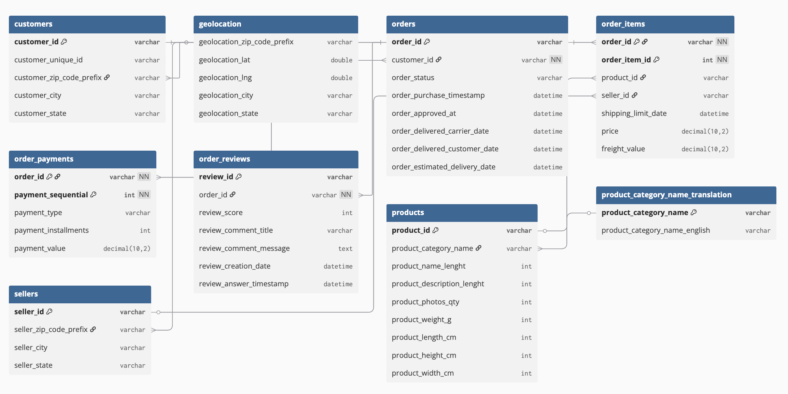

# 📊 Olist Brazilian E-Commerce Dataset – Data Visualization Project

## 📌 Описание проекта
Этот проект использует **Brazilian E-Commerce Public Dataset by Olist** для построения запросов и визуализаций.  
Основная цель — изучить структуру данных (Customers, Orders, Products, Payments и др.) и извлечь полезные бизнес-метрики с помощью SQL и Python (pandas, matplotlib, seaborn).  



## 📂 Структура данных
Используемые таблицы:
- `customers` – информация о клиентах  
- `orders` – информация о заказах (время, статус, доставка)  
- `order_items` – товары в заказах  
- `order_payments` – способы оплаты  
- `order_reviews` – отзывы покупателей  
- `products` – данные о товарах (категории, размеры, фото)  
- `sellers` – информация о продавцах  
- `geolocation` – координаты по zip-коду  
- `product_category_name_translation` – перевод категорий на английский  

## 🗄️ Схема базы данных
База данных называется `olist_db`.  
Основные связи:
- `orders.customer_id → customers.customer_id`  
- `order_items.order_id → orders.order_id`  
- `order_items.product_id → products.product_id`  
- `order_items.seller_id → sellers.seller_id`  
- `order_payments.order_id → orders.order_id`  
- `order_reviews.order_id → orders.order_id`  

## ⚙️ Установка
1. Установить СУБД (MySQL или PostgreSQL).  
2. Создать базу:
   ```sql
   CREATE DATABASE olist_db;
   ```
3. Импортировать CSV-файлы в соответствующие таблицы.  
4. Настроить подключение в `config` Python-скрипта:
   ```python
   config = {
       "host": "localhost",
       "user": "root",          # или postgres
       "password": "your_password",
       "database": "olist_db"
   }
   ```

## 📑 Примеры SQL-запросов
### Количество заказов по месяцам
```sql
SELECT DATE_FORMAT(order_purchase_timestamp, '%Y-%m') AS month,
       COUNT(*) AS total_orders
FROM orders
GROUP BY month
ORDER BY month;
```

### Топ-10 штатов по числу клиентов
```sql
SELECT customer_state, COUNT(*) AS customer_count
FROM customers
GROUP BY customer_state
ORDER BY customer_count DESC
LIMIT 10;
```

### Средняя оценка по категориям товаров
```sql
SELECT p.product_category_name,
       AVG(r.review_score) AS avg_score
FROM order_items oi
JOIN products p ON oi.product_id = p.product_id
JOIN order_reviews r ON oi.order_id = r.order_id
GROUP BY p.product_category_name
ORDER BY avg_score DESC
LIMIT 10;
```

## 🐍 Python-код для визуализаций
```python
import pandas as pd
import matplotlib.pyplot as plt
import mysql.connector   # или psycopg2 для PostgreSQL

conn = mysql.connector.connect(
    host="localhost",
    user="root",
    password="your_password",
    database="olist_db"
)

df = pd.read_sql("""
    SELECT DATE_FORMAT(order_purchase_timestamp, '%Y-%m') AS month,
           COUNT(*) AS total_orders
    FROM orders
    GROUP BY month
    ORDER BY month;
""", conn)

plt.figure(figsize=(10,5))
plt.plot(df["month"], df["total_orders"], marker="o")
plt.xticks(rotation=45)
plt.title("Количество заказов по месяцам")
plt.xlabel("Месяц")
plt.ylabel("Количество заказов")
plt.tight_layout()
plt.show()

conn.close()
```

## 🚀 Результат
- Поднята база данных Olist.  
- Составлена ER-диаграмма связей между таблицами.  
- Реализованы SQL-запросы для анализа заказов, оплат, отзывов и географии.  
- Построены визуализации в Python.  
# dvassignment1
